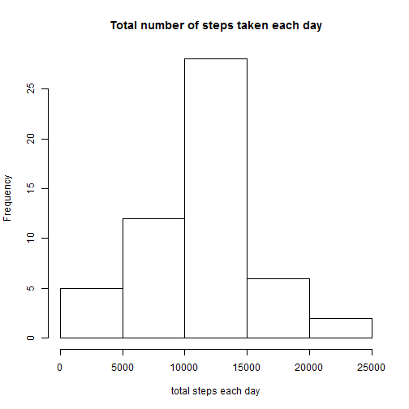
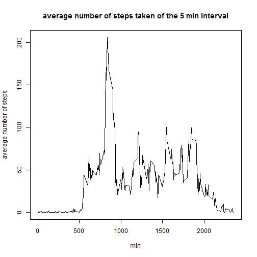
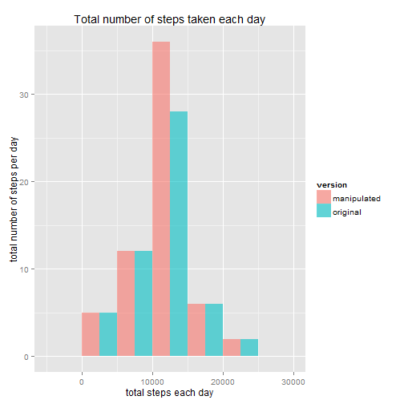
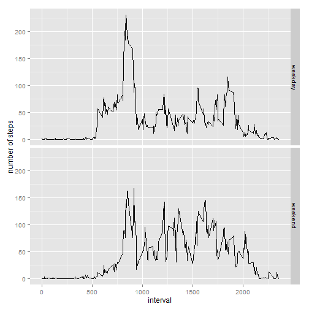

Peer Assessment 1
=====================

##Activity monitoring data analysis

###Loading and preprocessing the data


```r
temp<-tempfile()
download.file("http://d396qusza40orc.cloudfront.net/repdata%2Fdata%2Factivity.zip",temp)
file<-unz(temp,"activity.csv")
data<-read.csv(file)
unlink(temp)
```

###Total number of steps taken per day

Histogram of the total number of steps taken per day:


```r
total_steps<-aggregate(steps~date,data, sum)
hist(total_steps$steps,main="Total number of steps taken each day",xlab="total steps each day")
```

 

Mean and median of the total number of steps taken per day:


```r
mean_steps<-mean(total_steps$steps,na.rm=T)
median_steps<-median(total_steps$steps,na.rm=T)
```

Mean: 1.0766189 &times; 10<sup>4</sup>. 

Median: 10765. 

###Average daily activity pattern

Graph showing the average number of steps taken per day of the 5 min intervals:


```r
average_steps<-aggregate(steps~interval,data=data,FUN=mean,na.rm=T)
with(average_steps,plot(interval,steps,type="l",main="average number of steps taken of the 5 min interval",xlab="min",ylab="average number of steps"))
```

 

Inverval of the maximum number of average steps:


```r
interval_max<-average_steps[which(average_steps$steps==max(average_steps$steps)),1]
```

Inverval of 835, on average across all the days in the dataset, contains the maximum number of steps. 

###Imputting missing values


```r
missing_values<-sum(!complete.cases(data))
```

The total number of missing values is 2304. 

Fill in the missing values with the mean for that 5 min interval:


```r
data2<-data
for (i in 1:nrow(data2)){
  if (is.na(data2$steps[i]))
    data2$steps[i]=average_steps$steps[which(average_steps$interval==data$interval[i])]
}
```

Histogram of the total number of steps taken per day of the original and manipulated dataset:


```r
total_steps2<-aggregate(steps~date,data2,sum)
total_steps$version<-"original"
total_steps2$version<-"manipulated"
total_steps_bind<-rbind(total_steps,total_steps2)
library(ggplot2)
ggplot(total_steps_bind,aes(steps,fill=version))+geom_histogram(binwidth=5000,position="dodge",alpha=0.6)+labs(title="Total number of steps taken each day")+labs(x="total steps each day")+labs(y="total number of steps per day")
```

 

Mean and median of the total number of steps taken per day using the manipulated dataset:


```r
mean_steps2<-mean(total_steps2$steps)
median_steps2<-median(total_steps2$steps)
```

Mean: 1.0766189 &times; 10<sup>4</sup>. 

Median: 1.0766189 &times; 10<sup>4</sup>. 

Conclusion of this part:

- The mean of the manipulated data 1.0766189 &times; 10<sup>4</sup> is the same as the original data 1.0766189 &times; 10<sup>4</sup>. 

- The median of the manipulated data 1.0766189 &times; 10<sup>4</sup> is slightly higher than the original data 10765. 

- From the figure above, we can see that the highest total number of steps is higher in the manipulated data compared to the original data. 

###Activity patterns between weekdays and weekends

Create a factor variable in the dataset with two levels of "weekday" and "weekend":


```r
data2$day<-"weekday"
data2$day[weekdays(as.Date(data$date))=="Saturday"]<-"weekend"
data2$day[weekdays(as.Date(data$date))=="Sunday"]<-"weekend"
data2$day<-as.factor(data2$day)
```

Plot of average number of steps taken of the 5 min interval across all weekday or weekends:


```r
average_steps_day<-aggregate(steps~interval + day,data2,mean)
ggplot(average_steps_day,aes(interval,steps))+geom_line()+facet_grid(day~.)+labs(y="number of steps")
```

 
